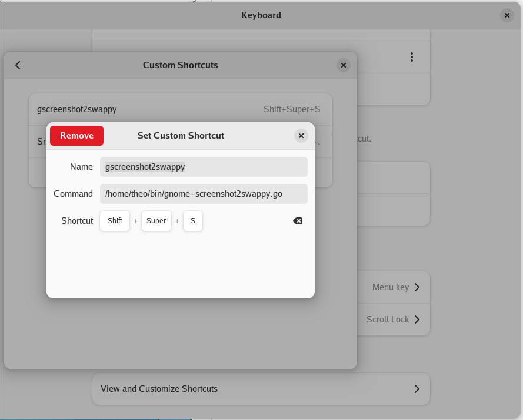

# What

A script to assign to a keyboard shortcut (e.g. super+shift+s like Windows), which uses gnome-screenshot to select an area, then passes it to [swappy](https://github.com/jtheoof/swappy) for annotations and then opens nautilus with the file preselected (if you save it to disk).

# How

A bash and go script as glue between the apps.

You need to add the custom shortcut to the custom keyboard shortcuts in Gnome settings. See:

# Why

I wanted a quick and simple way to take a screenshot, annotate it and be able to copy/paste (or drag'n'drop).
